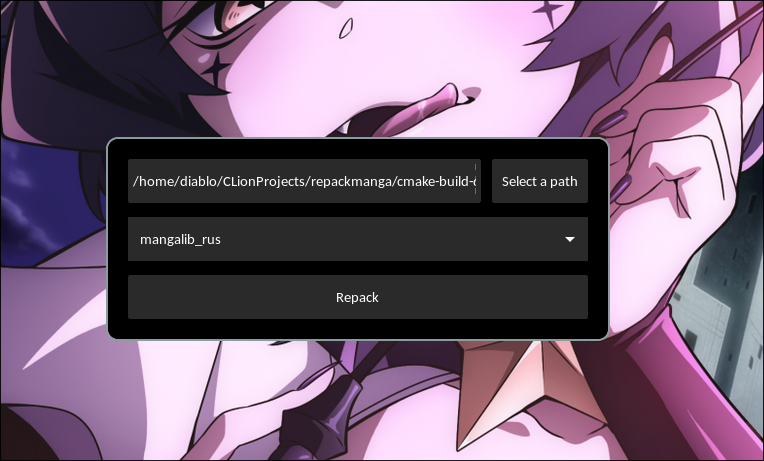
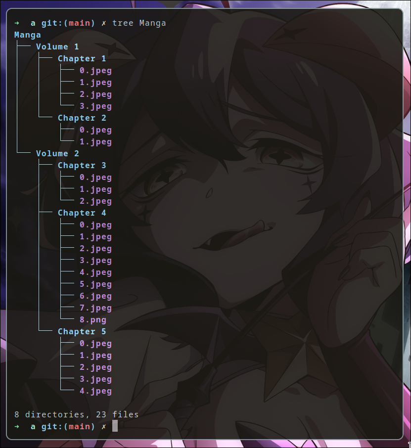

# RepackManga
___
#### Repackaging archives into a manga conversion structure via [KCC (a.k.a. Kindle Comic Converter)](https://github.com/ciromattia/kcc)


---
### [ ENGLISH ]
RepackManga is a tool that automates the process of organizing the directory structure of downloaded manga from a website such as mangalib.me. RepackManga collects volume and chapter number information from the title of each archive using certain patterns. It then creates a directory structure according to this information and automatically extracts the manga chapters into the appropriate directories
### [ RUSSIAN ]

RepackManga - это инструмент, который автоматизирует процесс организации структуры директорий скаченной манги с веб-сайта, такого как mangalib.me. RepackManga собирает информацию о номере тома и главы из названия каждого архива, используя определенные паттерны. Затем он создает структуру директорий в соответствии с этой информацией и автоматически распаковывает главы манги в соответствующие директории

https://github.com/govnorice/repackmanga/assets/80642969/29567b77-2038-438b-8be7-42cbe10b876d

## Structure of generated directories (supported by kcc):


## HOW TO USE
### GUI:
```
./repackmanga
```
### CLI:
```
./repackmanga --path <path to the directory with archives>
```
